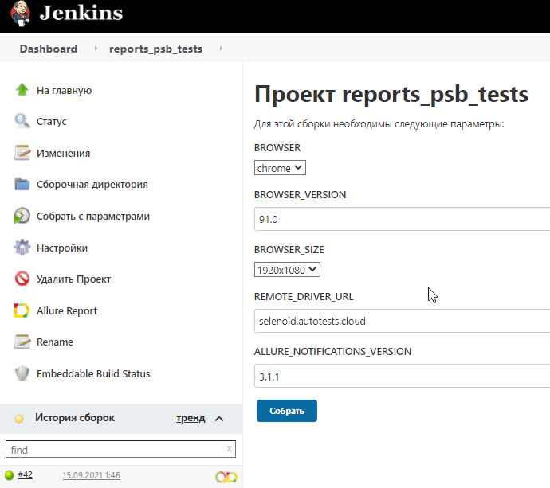

# Автотесты на https://www.psbank.ru/

## Technology Stack
<a href="https://www.jetbrains.com/idea/">
    
</a>
<a href="https://www.jetbrains.com/idea/">
    
</a>
<a href="https://www.jetbrains.com/idea/">
    
</a>
<a href="https://www.jetbrains.com/idea/">
    
</a>
<a href="https://www.jetbrains.com/idea/">
    
</a>
<a href="https://www.jetbrains.com/idea/">
    
</a>
<a href="https://www.jetbrains.com/idea/">
    
</a>
<a href="https://www.jetbrains.com/idea/">
    
</a>
<a href="https://www.jetbrains.com/idea/">
    
</a>
<a href="https://www.jetbrains.com/idea/">
    
</a>
<a href="https://www.jetbrains.com/idea/">
    
</a>
<a href="https://www.jetbrains.com/idea/">
    
</a>

IntelliJ IDEA, Java, Gradle, JUnit5, Rest-Assured, Selenide, Jenkins, Selenoid, Github, Allure TestOps, Jira, Telegram (notifications)
<br><br>

## Были реализованы следующие проверки:
### UI:

:heavy_check_mark: - Проверка заголовка на главной странице

:heavy_check_mark: - Проверка разделов на главной странице

:heavy_check_mark: - Проверка категорий на главной странице

:heavy_check_mark: - Проверка автоматически выбранного региона на главной странице


<br><br>
## Команды для запуска тестов из терминала
Для локального запуска тестов необходимо задать параметры в `local.driver.properies`
```
gradle clean test
```

<br><br>
## Видео прохождения одного из тестов

<br><br>

## В качестве CI системы был использован Jenkins
[Ссылка на джобу в Jenkins](https://jenkins.autotests.cloud/job/reports_for_psbank/)

### Указание параметров для запуска тестов

<br><br>

## В качестве системы Тест Менеджмента был использован Allure TestOps
### Основной дашборд для отслеживания

<br><br>

## Для отправки нотификаций был выбран Telegram


### Пример нотификации с результатом прохождения тестов


